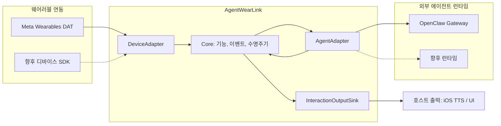

# AgentWearLink

[](https://github.com/JDeun/AgentWearLink/actions/workflows/swift.yml) [](https://github.com/JDeun/AgentWearLink/actions/workflows/docs.yml) [](LICENSE)

**웨어러블 디바이스와 기존 AI 에이전트 런타임을 벤더·모델에 종속되지 않는 인터페이스로 연결합니다.**

[English](README.md) · [빠른 시작](docs/getting-started.md) · [아키텍처](docs/architecture.md) · [전체 문서](docs/README.md) · [기여 가이드](CONTRIBUTING.md)

> [!IMPORTANT]
> **Pre-alpha / 통합 프리뷰** 단계입니다. Swift 패키지, 벤더 SDK 기반 시뮬레이터 테스트, 격리된 실제 OpenClaw Gateway 통합 계약은 구현 및 CI 검증을 마쳤습니다. **Ray-Ban Meta + iPhone + 실제 Mac/Tailnet 조합은 아직 실기기 검증되지 않았습니다.** 상용 배포 준비 완료 또는 실기기 호환성 확정으로 해석해서는 안 됩니다.

## 프로젝트 소개

AgentWearLink(AWL)는 웨어러블 입력, 기존 에이전트 실행, 호스트 출력을 연결하는 Swift 상호운용성 레이어입니다. 디바이스 이벤트와 기능을 공통 계약으로 변환하고, 에이전트 로직은 기존 런타임에 위임하며, 결과를 별도 출력 어댑터로 전달합니다.



**AWL은 에이전트 프레임워크를 대체하지 않습니다.** 모델·메모리·도구·RAG·MCP·오케스트레이션·세션은 연결된 에이전트 런타임이 담당합니다.

## 레퍼런스 구성

| 계층 | 현재 레퍼런스 |
| --- | --- |
| 웨어러블 | Ray-Ban Meta + Meta Wearables Device Access Toolkit(DAT) |
| 호스트 | iPhone, iOS 17.2+ |
| 네트워크 | Tailscale 사설 네트워크 |
| 에이전트 | Mac에서 실행하는 OpenClaw Gateway (예: Mac mini) |
| 출력 | 호스트에서 실행하는 `AVSpeechSynthesizer` 기반 Apple TTS |
| 비전 | 명시적 요청에서만 실행하는 크기 제한형 스냅샷 |

이 통합들은 **교체 가능한 레퍼런스 구현**이며 `AgentWearLinkCore`의 필수 의존성이 아닙니다. DAT Speech/Voice Invocation 지원이 곧 웨어러블 원시 PCM 접근이나 잠금 상태의 카메라 자동 실행을 의미하지는 않습니다.

## 빠른 시작

벤더 중립 Swift 패키지는 **Swift 5.10+ / macOS 14+**를 대상으로 합니다.

```bash
git clone https://github.com/JDeun/AgentWearLink.git
cd AgentWearLink
swift test
```

Meta DAT 실제 연동 패키지의 의존성을 해석하려면 별도로 **Swift 6.0+ 툴체인**이 필요하며, AWL 통합 소스는 현재 Swift 5 언어 모드를 사용합니다. 자세한 iOS 시뮬레이터·OpenClaw 검증 절차는 [빠른 시작 가이드](docs/getting-started.md)를 참고하세요.

## 패키지

| 제품 | 역할 |
| --- | --- |
| `AgentWearLinkCore` | 공통 이벤트·capability·interaction 수명주기·스트리밍·비전 계약 |
| `AgentWearLinkMetaDAT` | 웨어러블 어댑터 경계; 벤더 연결은 `Adapters/MetaDAT` |
| `AgentWearLinkOpenClaw` | Gateway WebSocket·인증·페어링·스트리밍·취소·재연결 |
| `AgentWearLinkAppleOutput` | 선택 가능한 호스트 출력 sink와 Apple TTS |
| `awl-openclaw-probe` | 명시적 읽기 전용 Gateway 연결 검사 |
| `awl-openclaw-chat-probe` | 명시적으로 활성화하는 에이전트 실행 검사(변경 작업 가능) |

## 검증 현황

| 검증 범위 | 상태 | 검증된 내용 |
| --- | --- | --- |
| Swift Core 및 어댑터 테스트 | **CI 통과** | 결정적 계약과 오류 처리 |
| Meta DAT 컴파일·MockDeviceKit | **CI 검증 범위** | 고정 SDK와 시뮬레이터 호스트 연동, 실기기 아님 |
| 고정 버전의 실제 OpenClaw Gateway | **CI 통과** | 격리 Gateway의 인증·명시적 승인·Grant 재사용/폐기·스트리밍·취소·2턴 세션 |
| iPhone ↔ Tailscale ↔ 실제 Mac | **미검증** | 사설 배포 환경 테스트 필요 |
| Ray-Ban Meta 카메라·오디오·음성 | **미검증** | 실기기·권한 설정 필요 |

실제 Gateway CI도 격리된 localhost Gateway와 **합성 로컬 모델**을 사용합니다. 개인 세션, 실제 모델의 메모리·도구 실행, 사람의 수동 승인, iOS Keychain 권한 또는 웨어러블 하드웨어까지 검증했다는 뜻은 아닙니다. [테스트와 CI](docs/testing.md), [미해결 이슈](https://github.com/JDeun/AgentWearLink/issues), [안정성 검증표](docs/reliability-matrix.md)를 참고하세요.

## 설계 원칙

- **공통 Core:** 디바이스 SDK와 에이전트별 프로토콜을 Core에 유출하지 않습니다.
- **최소 기능 원칙:** 실제 사용 가능한 capability만 광고합니다.
- **명시적 촬영:** 카메라 스냅샷은 사용자가 요청할 때만 실행하며 버퍼를 제한합니다.
- **안전한 전송:** 취소는 멱등적이며, 결과가 불확실한 변경 요청을 재연결 후 자동 재전송하지 않습니다.
- **데이터 최소화:** 개인 미디어를 기본적으로 보존하지 않고, 비밀키는 플랫폼 안전 저장소에 둡니다.
- **검증 수준 구분:** 시뮬레이터·격리 통합·배포·실기기 검증을 혼동하지 않습니다.

## 문서 · 기여 · 보안

[전체 문서](docs/README.md), [아키텍처](docs/architecture.md), [OpenClaw 연동](docs/openclaw.md), [Meta DAT 연동](Adapters/MetaDAT/README.md), [PRD](docs/PRD.md)를 참고하세요.

버그 및 기능 제안은 [GitHub Issues](https://github.com/JDeun/AgentWearLink/issues)에서 받습니다. 변경 제안 전에는 [CONTRIBUTING.md](CONTRIBUTING.md), 보안 제보 전에는 [SECURITY.md](SECURITY.md)를 확인하세요.

**라이선스:** [Apache-2.0](LICENSE).
