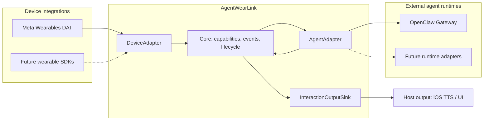

# AgentWearLink

[](https://github.com/JDeun/AgentWearLink/actions/workflows/swift.yml) [](https://github.com/JDeun/AgentWearLink/actions/workflows/docs.yml) [](LICENSE)

**Connect wearable devices to existing AI agent runtimes—without coupling your application to a device vendor or model provider.**

[한국어](README.ko.md) · [Get started](docs/getting-started.md) · [Architecture](docs/architecture.md) · [Documentation](docs/README.md) · [Contributing](CONTRIBUTING.md)

> [!IMPORTANT]
> **Pre-alpha / integration preview.** The Swift packages, vendor-backed simulator tests, and isolated real OpenClaw Gateway contracts are implemented and CI-tested. **The reference Ray-Ban Meta + iPhone + Mac/Tailnet deployment has not been physically validated.** This is not a production-readiness or hardware-compatibility claim.

## Overview

AgentWearLink (AWL) is a Swift interoperability layer for wearable input, agent execution, and host-owned output. It translates device capabilities and events into vendor-neutral contracts, delegates intelligence to an **existing agent runtime**, and routes responses to a replaceable output sink.



**AWL does not replace an agent framework.** Models, memory, tools, RAG, MCP, orchestration, and sessions remain the responsibility of the connected runtime.

## Reference stack

| Layer | Current reference |
| --- | --- |
| Wearable | Ray-Ban Meta via Meta Wearables Device Access Toolkit (DAT) |
| Host | iPhone, iOS 17.2+ reference integration |
| Connectivity | Private Tailscale deployment |
| Agent | OpenClaw Gateway on a Mac (reference: Mac mini) |
| Output | Host-owned Apple speech synthesis via `AVSpeechSynthesizer` |
| Vision | Explicit, bounded, event-driven camera snapshots |

These are **replaceable reference integrations**, not dependencies of `AgentWearLinkCore`. Wearable PCM capture and unattended background camera access are **not** implied by DAT speech or invocation support.

## Quick start

For the vendor-neutral Swift package, use **Swift 5.10+** and **macOS 14+**:

```bash
git clone https://github.com/JDeun/AgentWearLink.git
cd AgentWearLink
swift test
```

The concrete Meta DAT adapter has a separate **Swift 6.0+ toolchain** requirement to resolve the pinned vendor SDK; its integration sources currently use Swift 5 language mode. See the [installation and verification guide](docs/getting-started.md) for the iOS simulator and OpenClaw pathways.

## Packages

| Product | Purpose |
| --- | --- |
| `AgentWearLinkCore` | Vendor-neutral events, capabilities, interaction lifecycle, bounded streaming and vision contracts |
| `AgentWearLinkMetaDAT` | Device adapter boundary; concrete vendor integration is in `Adapters/MetaDAT` |
| `AgentWearLinkOpenClaw` | Gateway WebSocket, device identity, pairing, streaming, cancellation and reconnect |
| `AgentWearLinkAppleOutput` | Optional host output sink and Apple TTS |
| `awl-openclaw-probe` | Explicit read-only Gateway connectivity probe |
| `awl-openclaw-chat-probe` | Explicit, potentially mutating agent turn probe |

## Validation status

| Evidence level | Status | What it establishes |
| --- | --- | --- |
| Swift Core and adapter tests | **CI passing** | Deterministic contracts and error handling |
| Meta DAT compile / MockDeviceKit | **CI covered** | Pinned SDK and simulator-hosted integration; **not** physical hardware |
| Real pinned OpenClaw Gateway | **CI passing** | Isolated Gateway auth, exact-ID approval, grant reuse/revocation, streaming, abort, and two-turn session smoke |
| iPhone ↔ Tailscale ↔ actual Mac | **Not yet accepted** | Requires private deployment testing |
| Physical Ray-Ban Meta camera/audio/voice | **Not yet accepted** | Requires wearable, iPhone and permissioned DAT app |

The real Gateway checks use a disposable localhost Gateway and a **synthetic local model**. They do not validate personal sessions, real-model memory/tool behavior, a human approval ceremony, iOS Keychain entitlements, or wearable hardware. See [evidence and CI gates](docs/testing.md), [open acceptance work](https://github.com/JDeun/AgentWearLink/issues), and the [validation matrix](docs/reliability-matrix.md).

## Engineering principles

- **Portable Core:** Vendor SDK types and agent-specific protocols stay outside Core.
- **Least capability:** Advertise only supported, currently available device actions.
- **Explicit capture:** Camera snapshots are opt-in and bounded; continuous video is not the default.
- **Safe delivery:** Cancellation is idempotent; reconnect must never silently replay an uncertain mutating request.
- **Data minimization:** No private media retention by default; secrets stay in platform secure storage.
- **Evidence-based claims:** Simulator, isolated integration, deployment, and physical acceptance remain distinct.

## Documentation and support

Start with the [documentation index](docs/README.md) or the [getting-started guide](docs/getting-started.md). The [architecture](docs/architecture.md), [OpenClaw integration](docs/openclaw.md), [Meta DAT integration](Adapters/MetaDAT/README.md), and [product requirements](docs/PRD.md) describe the contracts in more depth.

Bug reports and proposals are welcome through [GitHub Issues](https://github.com/JDeun/AgentWearLink/issues). Before contributing, read [CONTRIBUTING.md](CONTRIBUTING.md); report sensitive issues according to [SECURITY.md](SECURITY.md).

**License:** [Apache-2.0](LICENSE).
