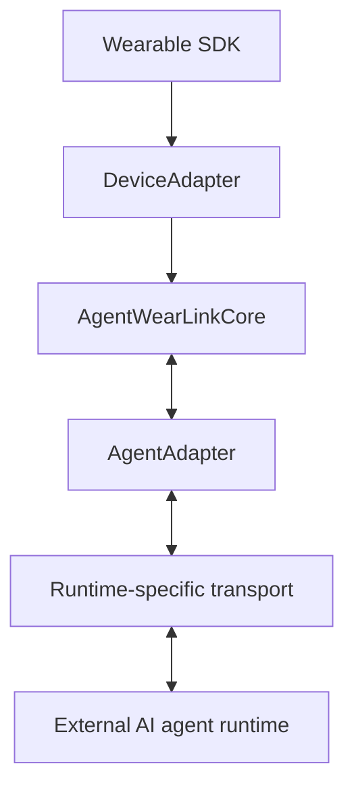
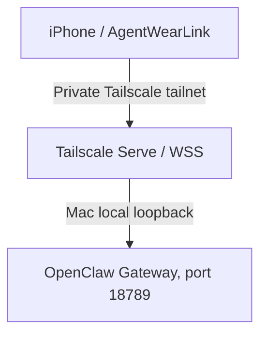

# AgentWearLink Product Requirements Document

**Version:** 0.4  
**Status:** Implementation requirements and acceptance criteria  
**Updated:** 2026-10-10  
**Repository:** AgentWearLink

> This document is the canonical product/scope handoff for continuing work in a new session. Read it together with `docs/architecture.md`, ADRs, open GitHub issues, and the current code before changing architecture.

## 1. Product definition

AgentWearLink (AWL) is an open interoperability layer between wearable devices and AI agent runtimes.

It converts vendor-specific wearable capabilities into normalized interactions and connects them to replaceable agent/runtime adapters. AWL is not an AI agent, model router, memory system, or chat service.

**Tagline:** Connect any wearable to any AI agent.

## 2. Reference deployment

The architecture is device-agnostic and agent-agnostic. The first implementation is deliberately narrow:

- Wearable: Ray-Ban Meta
- Device SDK: Meta Wearables Device Access Toolkit (DAT)
- Companion: iPhone
- Agent runtime: OpenClaw on a Mac mini
- Private network: Tailscale
- Preferred Gateway exposure: Tailscale Serve/WSS to an OpenClaw Gateway bound to loopback
- Visible conversation/log surface in the owner's deployment: Telegram through OpenClaw
- Initial TTS: iOS native speech synthesis
- Vision: explicit/event-driven snapshots only

Neither Meta, Ray-Ban, OpenClaw, Tailscale, Telegram, nor a TTS vendor may become an AWL Core dependency.

## 3. Problem

Wearable AI integrations commonly couple:

1. vendor SDK/device lifecycle,
2. media and invocation behavior,
3. network transport,
4. a specific model/provider,
5. agent orchestration and memory,
6. a specific chat/logging surface.

That coupling makes either side difficult to replace. AWL defines stable boundaries and lets the device and agent runtime evolve independently.

## 4. Architecture invariants

The following are invariants:

- Vendor SDK types do not leak into Core.
- Runtime-specific types do not leak into Core.
- Device events and agent request/response contracts remain distinct.
- Core does not decide which LLM/model/tool/memory to use.
- Reconnect restores transport state; it never silently replays uncertain mutating requests.
- Media queues are bounded.
- Unsupported capabilities are not advertised.
- Continuous camera capture is out of scope.
- Generic abstractions are expanded only when a real second implementation proves the need.

## 5. Current package boundaries

- `AgentWearLinkCore`: capabilities, normalized interactions, coordinator/runtime, generic transport primitives and deterministic mocks.
- `AgentWearLinkOpenClaw`: OpenClaw-specific HTTP/native Gateway protocol integration.
- `Adapters/MetaDAT`: pinned Meta DAT 1.0.0 integration. Registration, selected-device/session lifecycle, bounded one-shot camera, final Speech, independent Voice Invocation, dynamic capabilities, and foreground/background invalidation are now composed into the production `MetaDATDeviceAdapter` and iPhone reference host. Default still-photo capture uses the publishable-compatible Stream path; standalone `Camera.photo` remains DEBUG-only opt-in while experimental/non-publishable. App-hosted MockDeviceKit covers camera and voice behavior; #230 tracks cross-boundary evidence rather than a missing parallel session adapter. MockDeviceKit stays outside production dependencies.

Future device/runtime adapters should remain outside Core.

## 6. Functional requirements

### FR-1 Capability discovery

A DeviceAdapter exposes only implemented and currently available capabilities.

Current capability vocabulary includes text input, speech input, raw audio input, camera snapshot, speaker output, text output, and voice invocation. Speaker/text output bits are reserved for a future device-owned callable output surface; the current reference iPhone TTS/UI path is host-owned and is composed through `InteractionOutputSink`, so reference DeviceAdapters must not advertise those bits merely because the phone can render output.

### FR-2 Interaction lifecycle

AWL must represent stable interaction correlation IDs, start, text/invocation, interruption, completion, cancellation and typed failure. A Core `InteractionID` is not itself a runtime idempotency key: a later logical agent submission may reuse the same interaction correlation ID after the prior submission has terminated.

### FR-3 Agent boundary

Agent requests/responses are distinct from wearable events. Incremental output is supported where the runtime provides it. Runtime adapters must give each logical mutating submission its own stable idempotency identity: the same submission keeps that identity for reconciliation, while a genuinely new submission receives a fresh identity.

### FR-4 Runtime lifecycle

Runtime start/stop must be deterministic and idempotent. Cancellation must propagate across the boundary. Completed tasks must not be retained. Normalized runtime output may be delivered through a typed `InteractionOutputSink`; host output lifecycle must remain separate from wearable input ownership.

### FR-5 Transport

Supported transport architecture includes buffered HTTP, SSE primitives, WebSocket, and future local IPC. Transport and agent semantics remain separate.

### FR-6 OpenClaw

Two integration paths are allowed:

1. HTTP Chat Completions compatibility path.
2. Native Gateway WebSocket path — preferred for session-aware, low-latency integration.

Native Gateway work must follow the current official protocol rather than guessed wire formats.

### FR-7 Tailscale deployment

Tailscale is an endpoint/security profile, not an SDK dependency.

Preferred owner topology:

AWL must tolerate Wi-Fi/cellular transitions, Tailnet re-establishment, Gateway restart, and Mac sleep/restart.

### FR-8 OpenClaw device identity

A remote mobile client must support OpenClaw's current device identity/pairing model:

- persistent Ed25519 device identity,
- wait for `connect.challenge`,
- bind the server nonce/timestamp into the signed device proof,
- persist issued device token and approved grant securely,
- handle pairing-required as an explicit state,
- require fresh authenticated connect after approval,
- re-read negotiated policy on every reconnect.

Private Tailnet reachability does not replace device authorization.

### FR-9 Speech/audio

The first implementation should prefer Meta DAT speech/ASR when viable and iOS native TTS for response speech. Raw audio transport is added only with explicit ownership, cancellation, buffer and retention rules.

### FR-10 Vision

Camera access is event-driven. An image is captured only for an explicit vision interaction and only sent when the target agent path supports image input.

### FR-11 Existing agent semantics

AWL must use the existing OpenClaw agent/session semantics. It must not create a parallel intelligence layer.

Telegram may remain a canonical visible history/delivery surface in the owner's deployment, but AWL does not call Telegram directly.

## 7. Security and privacy requirements

- No credentials or device private keys in source control.
- iOS secrets/device identity stored in Keychain/Secure Enclave-compatible platform storage where practical.
- Prefer private WSS/TLS paths.
- Honor negotiated Gateway payload/buffer/attachment limits.
- Never log authentication frames, tokens, private keys or raw private media.
- Pairing/scope upgrades require explicit handling.
- Request minimum necessary OpenClaw scopes.
- A disconnected/reconnected socket does not imply an application request may be replayed.
- Media retention defaults to none.

## 8. Reliability requirements

Must test:

- duplicate request suppression,
- cancellation races,
- task cleanup,
- device reconnect,
- agent/Gateway reconnect,
- Wi-Fi ↔ cellular transition,
- Tailnet tunnel re-establishment,
- late responses after cancellation,
- non-monotonic/stale Gateway events,
- bounded producer queues,
- TTS interruption,
- background/foreground transitions,
- Gateway policy changes after reconnect,
- pairing/token rotation/revocation.

## 9. Test layers

### Layer 1 — deterministic Core CI

No network/vendor SDK. AWL mocks validate lifecycle and contracts.

### Layer 2 — integration

- Meta Mock Device Kit ↔ Meta adapter
- local/mock HTTP/SSE/WebSocket ↔ transports
- development OpenClaw Gateway ↔ OpenClaw adapter

### Layer 3 — physical E2E

Ray-Ban Meta + physical iPhone + Mac mini/OpenClaw over the intended Tailnet.

Hardware-dependent features are not considered complete from mocks alone.

## 10. Delivery gates

### P0-A — Meta DAT physical validation

Validate official DAT sample on physical iPhone/Ray-Ban Meta: registration, connect, camera, speech/audio where exposed, disconnect/reconnect, OS/SDK/firmware versions.

### P0-B — Text E2E

Manual companion trigger → AWL → existing OpenClaw session → incremental text response over the real Tailnet.

### P0-C — Audio E2E

Wearable speech/audio → existing agent → streaming response → iOS TTS/device audio.

### P0-D — Hands-free invocation

Validate DAT/Hey Meta invocation, Korean behavior, lock-screen/background behavior and coexistence with Meta AI.

### P1 — Event-driven vision

Explicit vision intent → snapshot → capability check → multimodal agent path.

### P2 — Reliability/security

Network transitions, pairing, token rotation/revocation, reconnect, interruption, bounded queues, observability and privacy hardening.

## 11. Success criteria

The first reference implementation succeeds when:

1. the iPhone can remain locked/in a pocket during normal interaction,
2. the user initiates interaction from Ray-Ban Meta,
3. the existing OpenClaw runtime on the Mac mini handles the request,
4. the connection works through the intended private Tailnet deployment,
5. the response is returned audibly through the wearable path,
6. existing OpenClaw model/tool/memory/session behavior is preserved,
7. the interaction can remain visible in the existing Telegram workflow without Telegram becoming an AWL dependency,
8. explicit vision requests work without continuous capture.

## 12. Non-goals

AWL Core will not implement:

- LLM/model routing,
- persistent agent memory,
- RAG,
- MCP/tool orchestration,
- Telegram business logic,
- continuous surveillance,
- a replacement for OpenClaw/Hermes/etc.,
- speculative device/runtime adapters that cannot be tested.

## 13. Continuation checklist

When resuming work in another session:

1. Read this PRD.
2. Read `docs/architecture.md` and ADRs.
3. Inspect current `main`, open issues and open PRs.
4. Do not assume old OpenClaw or Meta DAT API shapes; verify current official docs.
5. Run/inspect CI before merging.
6. Preserve Core/vendor/runtime boundaries.
7. Continue the earliest unblocked delivery gate.
8. Record material architectural changes in this PRD and/or a new ADR.

## 14. Historical implementation checkpoint — 2026-10-08

### Merged code-side foundation

- Core contracts/runtime/coordinator, lifecycle, bounded transport and image/audio budgets, no-replay cancellation behavior and deterministic tests.
- Native OpenClaw WebSocket/agent adapter: challenge-bound Ed25519 identity, Keychain device grants, Gateway policy/scope checks, RPC/event routing, incremental/terminal responses and reconnect supervision.
- Pinned Meta DAT production adapter: selected device, dynamic capability, bounded photo capture, Speech final transcript, independent Voice Invocation, foreground/background retirement and optional post-ack foreground media handoff.
- App-hosted MockDeviceKit exercises production camera capture, denied permission, opt-in experimental Photo success/failure, and Voice Invocation → Speech → Core mock agent. Full iOS reference-host compilation and phone-owned TTS are CI-gated.
- PR #587 isolated macOS XCTest suites and preserved full coverage; PR #591 fixed cleanup of orphan XCTest children after their SwiftPM parent exits. Neither independently proves the root cause of #542 permanently fixed.

### Pre-hardware exit gates at the time of this checkpoint

1. **CI lifetime (#542):** repeat independent macOS Core/XCTest runs and investigate any pre-test worker stalls. Do not accept a single green run or suppress failing cases.
2. **Isolated real development Gateway (#331):** execute the production native adapter against an actual revision-recorded independent OpenClaw process. Capture authenticated health, harmless accepted agent run, incremental/terminal response, abort, pairing/reconnect grant reuse and bounded cleanup. Self-authored fixtures or a merely implemented launch script do not satisfy this gate.
3. **App composition (#230/#95):** confirm the pinned vendor app-hosted camera/voice/Speech path and user-initiated foreground reuse of an approved endpoint-scoped Keychain grant. Foreground voice wake is not unattended locked-phone OS startup or glasses speaker playback.
4. **Exact SDK validation:** every required Core, vendor Meta, app-hosted simulator and reference iPhone build check must pass on the actual merge candidate. Default Camera Stream still capture remains available; experimental standalone Photo is not presented as publishable.
5. **Issue audit:** classify each remaining issue as software (#542/#331), upstream SDK (#303/#323), private deployment (#56/#97/#117/#118) or physical device (#1/#5/#6/#58/#59/#98). Do not close deployment/physical acceptance on simulator-only evidence.

### Post-gate deployment and physical acceptance

- Official unchanged DAT CameraAccess on physical Ray-Ban Meta + iPhone, with exact OS/SDK/glasses firmware and real lifecycle, camera, Speech and link evidence (#1/#98).
- Physical iPhone → Tailscale → Mac mini/OpenClaw accepted native interaction, separately paired persistent identity, existing-session model/tools/memory, network transitions and no Telegram transport dependency (#56/#97/#117/#118).
- Verify actual microphone/speaker routing versus phone-owned Apple TTS; locked/pocketed voice activation, explicit vision-agent one-shot snapshot, memory/leak profiles and all privacy/recovery matrix rows (#5/#6/#58/#59/#303).

**Evidence rule:** compilation and MockDeviceKit do not establish real Bluetooth, Tailnet, live Gateway or background privileges. A runnable harness is not proof the harness passed. Keep code/physical issues open until their distinct acceptance is recorded.

## 15. Current evidence and remaining acceptance — 2026-10-10

The pre-hardware milestone described in `14 is **historical**. By 2026-10-10, the previously open composition work (#230/#95), Core CI stability work, and isolated real Gateway contract have been implemented and accepted at their respective **code/simulator/CI** evidence levels.

- The pinned real Gateway Layer-2 CI now verifies unapproved rejection, explicit automated exact-ID read-only approval, server-issued grant persisted through two Swift processes, native macOS Keychain grant reuse, server-recorded revocation and rejected reuse, agent streaming, active-run abort, and two same-session turns backed by a **synthetic local model**.
- All three required workflows passed against merged `main` commit `2120981585df9f9f1b6a05f470952e85ef9c581f`: Swift Core, development harness, and pinned real Gateway.
- Completed CI does **not** prove human review of device pairing, actual Mac/OpenClaw/Tailnet deployment, physical iPhone Keychain entitlement behavior, a live model's memory or tool semantics, or Meta wearable camera/voice/audio performance.
- The remaining [open issues](https://github.com/JDeun/AgentWearLink/issues) are retained for private deployment/physical acceptance, upstream Meta SDK constraints, and any subsequently discovered defects.

Use [testing.md](testing.md), the [isolated real Gateway contract](development-openclaw-gateway.md), and open issues for the current evidence. Do **not** re-interpret earlier ``14 gates as still-unimplemented code tasks or close physical acceptance based on code-only CI.
