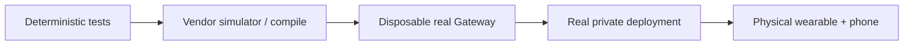

# AgentWearLink documentation

**Developer guide and reference documentation for the pre-alpha wearable/agent interoperability layer.**

[Project overview](../README.md) · [한국어 README](../README.ko.md) · [Report an issue](https://github.com/JDeun/AgentWearLink/issues)

> [!NOTE]
> This repository documents **implemented code and evidence**, not a verified consumer hardware product. Every validation claim distinguishes deterministic tests, simulator/vendor integration, isolated real Gateway smoke, actual deployment, and physical-device acceptance.

## Start here

| I want to… | Read |
| --- | --- |
| Build and run the first tests | **[Getting started](getting-started.md)** |
| Understand the overall design | **[Architecture](architecture.md)** and [transport contracts](transports.md) |
| Understand readiness and run CI | **[Testing and validation](testing.md)** |
| Work on the wearable integration | **[Meta DAT iOS adapter](meta-dat-ios.md)** |
| Connect an existing agent | **[OpenClaw reference adapter](openclaw.md)** |
| Follow the private network topology | **[Tailscale deployment](tailscale.md)** |
| Work through requirements | **[PRD](PRD.md)** |
| Submit a change | **[Contributing](../CONTRIBUTING.md)** |

## Integration reference

### Wearables and iOS

| Topic | Document |
| --- | --- |
| API boundaries and concrete host bridge | [Meta DAT bridge](meta-dat-bridge.md) |
| SDK capability and permission contracts | [Meta DAT capabilities](meta-dat-capabilities.md) |
| Simulator and vendor mock evidence | [MockDeviceKit guide](meta-mock-device-kit.md) |
| Physical-device checklist (P0-A) | [Meta DAT validation](meta-dat-validation.md) |
| Vendor code cross-audit | [Meta DAT audit](meta-dat-audit.md) |
| Known upstream and physical limits | [Meta DAT known issues](meta-dat-known-issues.md) |
| Concrete vendor package | [Adapters/MetaDAT](../Adapters/MetaDAT/README.md) |

### OpenClaw and networking

| Topic | Document |
| --- | --- |
| Gateway protocol / identity / session semantics | [OpenClaw integration](openclaw.md) |
| Pinned upstream protocol version | [Gateway protocol contract](openclaw-protocol-contract.md) |
| Local disposable Gateway acceptance | [Development Gateway tests](development-openclaw-gateway.md) |
| Read-only auth/pairing test | [OpenClaw probe](openclaw-probe.md) |
| Opt-in mutating agent turn | [OpenClaw chat probe](openclaw-chat-probe.md) |
| Actual iPhone/Tailnet/Mac acceptance | [P0-B runbook](p0b-openclaw-validation.md) |
| Reachability and TLS | [Tailscale deployment](tailscale.md) |
| Transport responsibilities and budgets | [Transport contracts](transports.md) |

### Quality and design decisions

| Topic | Document |
| --- | --- |
| CI layers and test commands | [Testing](testing.md) |
| Failure-mode regression matrix | [Reliability](reliability-matrix.md) |
| Redacted diagnostics | [Diagnostics](diagnostics.md) |
| Dependency boundaries | [ADR-0001](adr/0001-core-boundaries.md) |
| Runtime owns intelligence | [ADR-0002](adr/0002-agent-runtime-owns-intelligence.md) |

## Validation evidence hierarchy

Each step provides **different** evidence; an earlier green gate cannot substitute for a later one. The disposable Gateway CI intentionally uses a **synthetic model** and does not validate human approval, live tool/memory semantics, real Tailscale or physical wearables.

## Sources of truth

- **Requirements and intended acceptance criteria:** [PRD](PRD.md).
- **Current behavior:** versioned code and tests in this repository.
- **Unfinished acceptance:** [open GitHub issues](https://github.com/JDeun/AgentWearLink/issues).
- **Security and private media:** [SECURITY.md](../SECURITY.md).

If a document conflicts with tested behavior, correct the document and link the exact issue/CI evidence rather than upgrading the claim.
