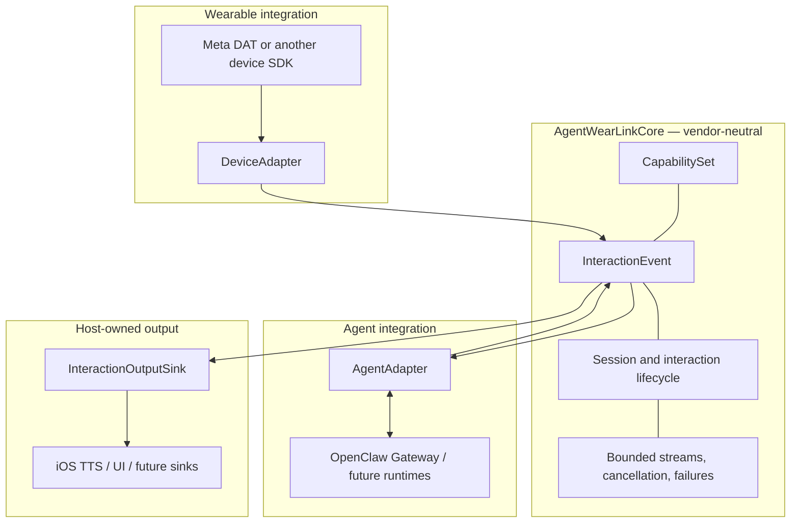
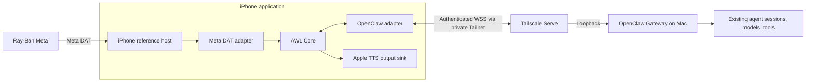
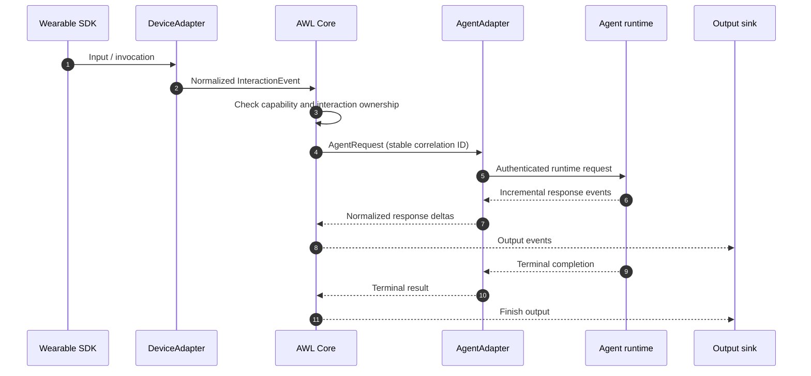

# Architecture

AgentWearLink is a **wearable-to-agent I/O interoperability layer**, not a new AI agent runtime. The design isolates vendor SDKs, agent protocols, and output surfaces so they can evolve independently.

## System boundaries

**Dependency rule:** Device SDK and agent protocol types terminate at their respective adapters. `AgentWearLinkCore` depends on neither Meta DAT, OpenClaw, Tailscale nor host TTS. A host composes the concrete adapters and output sink.

## Reference deployment

The network is reference deployment infrastructure, **not** an AWL Core dependency. Telegram can remain a separate OpenClaw conversation surface; AWL neither calls Telegram nor synchronizes Telegram sessions directly.

## Core contracts

| Contract | Responsibility | Explicitly not responsible for |
| --- | --- | --- |
| `DeviceAdapter` | Device connect/disconnect, available capabilities, normalized device and lifecycle events | Exposing vendor SDK types upstream or owning host TTS |
| `AgentAdapter` | Authenticate and map agent requests, stream normalized responses, propagate cancellation and typed failures | Implementing models, prompts, RAG, MCP or orchestration |
| `InteractionOutputSink` | Consume normalized output and own UI/TTS delivery, interruption and terminal signals | Claiming a phone output as a headset capability |
| `AgentWearLinkRuntime` | Compose adapters, lifecycle, interaction coordination and safe shutdown | Automatically replaying uncertain agent mutations |

### Device event ordering

The host subscribes before a device session is connected. Device adapters retain early connect-time events in **finite buffers/coalescing slots** until consumption begins, without exposing a failed startup generation.

### Capability negotiation

Current vocabulary includes `textInput`, `speechInput`, `rawAudioInput`, `cameraSnapshot`, `speakerOutput`, `textOutput` and `voiceInvocation`. Vocabulary alone is **not** a promise of callable support. Current reference device adapters must not advertise iPhone TTS/UI as wearable capabilities; these are optional host output sinks. Raw audio is separately gated pending a concrete ownership, backpressure and retention contract.

## Interaction lifecycle

The diagram shows an illustrative successful agent text turn. Authentication/pairing may require a distinct, explicit approval step.

## Safety and reliability invariants

- Each logical interaction has a stable correlation ID. A **new** agent submission receives its own adapter idempotency identity; reconciliation of the **same** submission retains its identity.
- Only one submission for a given interaction is admitted concurrently, although a later new submission may be valid after the previous one terminates.
- Cancellation and stop are idempotent. Late outputs from cancelled or retired generations are ignored.
- Reconnect restores transport availability; it **does not** silently replay a mutating request with uncertain delivery.
- Incoming streams and media are bounded. An explicit camera snapshot has bounded attachment ownership and a capability check before capture.
- Runtime-side memory, model choice, tools, RAG, MCP, and orchestration remain owned by the external agent runtime.
- Secrets, private media, and bearer tokens are not logged. Persistent identities and grants use secure storage in deployed hosts.

For concrete failure cases and evidence boundaries, see [testing](testing.md), [reliability](reliability-matrix.md), [OpenClaw](openclaw.md), and [security](../SECURITY.md).

## Evolution policy

Add a new capability or abstraction when a real adapter demonstrates the need. Do not generalize SDK-specific behavior or assume a future runtime supports a protocol until the actual integration proves it.

The architecture decisions are recorded in [ADR-0001](adr/0001-core-boundaries.md) and [ADR-0002](adr/0002-agent-runtime-owns-intelligence.md).
