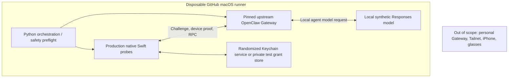

# Isolated real OpenClaw Gateway integration

**Layer 2: real Gateway protocol, no personal deployment or wearable hardware.**

This runbook describes the opt-in, hermetic validation harness used by AgentWearLink. Unlike a WebSocket fixture, it launches the **pinned upstream OpenClaw Gateway** and executes AWL's production Swift connection, dispatcher, supervisor and agent adapter against it.

> [!IMPORTANT]
> Passing these tests does **not** prove the owner's Mac, iPhone, Tailnet, Ray-Ban Meta, iOS Keychain entitlements, human device approval or real-model memory/tool behavior. CI agent turns use a synthetic local model.

## Architecture and trust boundary



The harness selects a fresh loopback port, synthetic auth token, isolated HOME/state and workspace, and owned process groups. No inherited personal Gateway credentials, provider keys, Tailnet settings, private conversations or media are loaded. Cleanup is bounded and restricted to owned resources.

## Required toolchain and protocol pin

- The **real Gateway CI** workflow runs on GitHub-hosted macOS 26 and checks out the exact upstream commit configured in [real-openclaw-gateway.yml](../.github/workflows/real-openclaw-gateway.yml).
- The [pinned protocol contract](openclaw-protocol-contract.md) records the protocol-v4 assumptions. A protocol number alone is insufficient to justify upgrading OpenClaw.
- The harness requires a clean source checkout, a matching **40-character Git SHA** and the built upstream `dist/entry.js`; it never launches an unrelated globally installed OpenClaw.
- For local manual tests, use a deliberately isolated development source tree, model and profile—not an existing personal gateway.

## Automated contracts

| Mode | What must pass | Evidence limit |
| --- | --- | --- |
| `--expect-pairing-required` | Unapproved, fresh read-only Swift identity rejected by real Gateway with local auto-approval disabled | Negative auth only |
| `--expect-health-ok` | Authenticated hello and read-only health with isolated auto-approval | Not human consent or persistent credentials |
| `--expect-grant-reconnect` | Real server-issued read-only grant; second Swift process reconnects without shared bearer using a private test store | Not production Keychain |
| `--expect-native-keychain-grant-reconnect` | Same actual Gateway grant persisted and reused through native macOS Keychain / Security.framework | macOS CI only, not iOS |
| `--expect-explicit-approval-revocation` | Auto-approval disabled → one exact `operator.read` pending request → automated CLI approval → issued grant → bearer-free reconnect → revoke exact token → verify server-side `revokedAtMs` → reject reconnect | **Automated** exact-ID approval, not a human review |
| `--expect-agent-stream` | Production native agent receives incremental text and terminal event from real Gateway via local synthetic Responses provider | Not a real LLM |
| `--expect-agent-abort` | Gateway accepts a run, mock provider observes ingress, `chat.abort` is confirmed before held response completes | Active-run cancellation only |
| `--expect-agent-session` | Two distinct native interactions complete under one real Gateway session and advance synthetic model ingress | Not live model memory/tool quality |

The generated model has tools disabled and requires no provider API keys. All modes are mutually exclusive, require disposable state, and fail closed when their identity, source, endpoint or contract cannot be verified.

### Example: read-only isolated contracts

After building the pinned upstream checkout separately:

```bash
python3 scripts/run_hermetic_development_gateway.py \
  --checkout /path/to/built-openclaw \
  --revision YOUR_EXACT_40_CHARACTER_COMMIT \
  --expect-pairing-required

python3 scripts/run_hermetic_development_gateway.py \
  --checkout /path/to/built-openclaw \
  --revision YOUR_EXACT_40_CHARACTER_COMMIT \
  --expect-health-ok
```

The actual CI runner is configured by the pinned [workflow](../.github/workflows/real-openclaw-gateway.yml); do not imitate CI-only macOS Keychain or automated approval flags against a personal Gateway.

## Manual, isolated operator approval

The separate terminal-based path requires a **person** to inspect and enter an exact pending request ID. No `--latest` shortcut, cross-device approval, or arbitrary request ID is admitted.

```bash
python3 scripts/run_hermetic_development_gateway.py \
  --checkout /path/to/built-openclaw \
  --revision YOUR_EXACT_40_CHARACTER_COMMIT \
  --approve-isolated-pairing
```

The helper invokes the pinned upstream `devices list/approve` CLI with the **disposable Gateway token** and explicit localhost URL. It is TTY-gated and cannot run on an arbitrary Tailnet endpoint. Its success is distinct from the automated exact-ID CI contract above, which does **not** establish a human approval ceremony.

## Optional isolated agent integration

A deliberately harmless, **non-personal** agent config may be supplied for an operator-run smoke test. Ensure tools are disabled or restricted; the harness does not import the user's model credentials.

```bash
AWL_DEV_ISOLATED_MODEL_ACK=1 \
python3 scripts/run_hermetic_development_gateway.py \
  --checkout /path/to/built-openclaw \
  --revision YOUR_EXACT_40_CHARACTER_COMMIT \
  --full-chat \
  --config-template /path/to/synthetic-development-openclaw.json
```

`--prove-abort` is optional and should be used only when the isolated test provider deliberately keeps an accepted run active until cancellation.

## CI and acceptance

The dedicated [real Gateway workflow](../.github/workflows/real-openclaw-gateway.yml) runs on relevant pull requests **and on changes merged to `main`**. Its latest green state must be checked on the exact commit; previous run IDs are evidence of past revisions, not a promise of future compatibility.

The executable harness and its unit tests are maintained in:

- [Hermetic development Gateway runner](../scripts/run_hermetic_development_gateway.py)
- [Runner safety and contract tests](../scripts/test_run_hermetic_development_gateway.py)
- [Native Swift probe launcher](../scripts/dev_gateway_probe_runner.py)
- [Gateway preflight](../scripts/dev_gateway_preflight.py)

**Still outside Layer 2:** actual Mac/Tailnet + iPhone authenticated deployment ([P0-B](p0b-openclaw-validation.md)), real-model memory/tools, actual human/device-pairing review, and physical camera/audio/voice operation ([P0-A](meta-dat-validation.md)). Record those against the relevant [GitHub acceptance issues](https://github.com/JDeun/AgentWearLink/issues), not as a consequence of hermetic CI.
