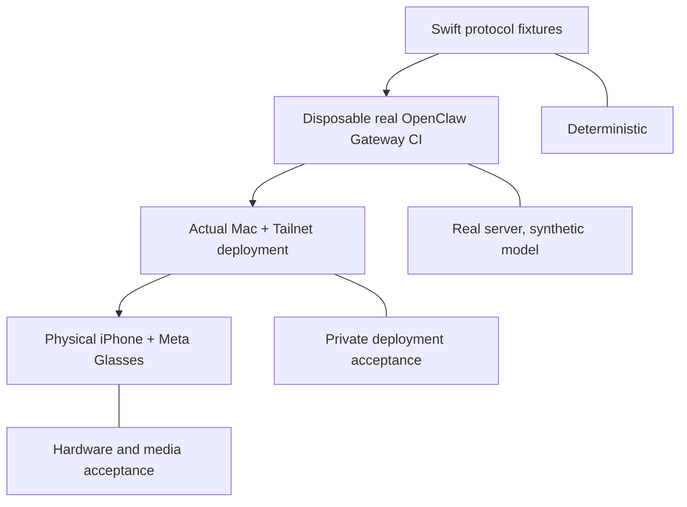

# Getting started

Choose the development path that matches the evidence you need. You **do not need Ray-Ban Meta, an iPhone, or an OpenClaw deployment** to build and test the vendor-neutral Core.

## Prerequisites

| Path | Requirements |
| --- | --- |
| Core and OpenClaw protocol tests | Swift 5.10+, macOS 14+; no live Gateway |
| Concrete Meta DAT integration | macOS, Xcode, Swift 6.0+ **toolchain**, iOS 17.2+ target, pinned Meta DAT revision |
| Vendor-backed iOS simulator | Xcode and a compatible installed iOS Simulator runtime; repository-pinned XcodeGen for the generated app host |
| Real OpenClaw deployment | An **operator-controlled** Gateway, approved device identity, private networking and credentials (not required for CI) |
| Physical acceptance | Permissioned Ray-Ban Meta, physical iPhone, actual Mac/Gateway and Tailnet |

> [!CAUTION]
> Pre-alpha means CI success does **not** certify physical wearable support, App Store policy compliance, live agent quality or production security.

## 1. Build the vendor-neutral Swift package

```bash
git clone https://github.com/JDeun/AgentWearLink.git
cd AgentWearLink
swift --version
swift test
```

This runs deterministic Core, Apple output, Meta adapter *boundary* and OpenClaw protocol tests. It does not require Meta DAT to be paired with a wearable.

## 2. Check the concrete Meta DAT integration

The vendor-linked package lives in `Adapters/MetaDAT`. It is separate from the root Swift 5.10+ package because the pinned Meta DAT 1.0.0 package manifest requires a **Swift 6.0+ toolchain**. AWL integration source language mode remains Swift 5.

```bash
swift --version
cd Adapters/MetaDAT
swift package resolve
xcodebuild \
  -scheme AgentWearLinkMetaDATIntegration \
  -destination 'generic/platform=iOS Simulator' \
  -skipPackagePluginValidation \
  build
```

Run these commands on macOS with Xcode. A successful compile confirms API compatibility, **not** sensor behavior or a usable headset connection. The app-hosted MockDeviceKit and XCUITest layers are covered in [Meta simulator evidence](meta-mock-device-kit.md) and [testing](testing.md).

For the generated host, run the repository-pinned installer from the **repository root**:

```bash
bash scripts/install-xcodegen.sh
export PATH="$PWD/.build/tools:$PATH"
xcodegen --version
```

Do not replace the pinned distribution with an unverified binary. For provisioning, permissions and an actual iPhone, use the [Meta DAT runbook](meta-dat-validation.md).

## 3. Understand the Gateway acceptance layers



The automated pinned Gateway workflow starts a **disposable local instance**, never a personal Gateway, and checks read-only health, device grants, explicit exact-ID approval, revocation, streaming, cancellation, and same-session turn semantics. The agent smoke uses a synthetic local model. [Layer-2 runbook](development-openclaw-gateway.md) describes how it is isolated.

To connect **your own Gateway**, follow the [read-only probe](openclaw-probe.md) first and the [opt-in agent chat probe](openclaw-chat-probe.md) only after authentication is proven. Do not copy private bearer tokens into issues, logs or CI.

## 4. Choose what to test next

| Goal | Start with |
| --- | --- |
| Understand the design | [Architecture](architecture.md) |
| Change Core or OpenClaw code | [Testing and CI](testing.md) |
| Implement or validate wearable behavior | [Meta DAT adapter](../Adapters/MetaDAT/README.md) and [physical P0-A checklist](meta-dat-validation.md) |
| Connect iPhone to a Mac Gateway | [Tailscale topology](tailscale.md) and [P0-B runbook](p0b-openclaw-validation.md) |
| Understand scope/credentials | [OpenClaw](openclaw.md) and [Security](../SECURITY.md) |
| Contribute a change | [Contributing](../CONTRIBUTING.md) |

## Troubleshooting

- **Swift manifest/toolchain mismatch:** Check which directory you are building. The root package has a Swift 5.10+ manifest; the concrete Meta DAT package needs a Swift 6.0+ toolchain.
- **Missing simulator/runtime:** Install a supported iOS Simulator with Xcode; generic simulator builds do not execute MockDeviceKit scenarios.
- **Pairing required:** A new Gateway identity needs explicit approval. Do not turn off authentication or automatically grant admin scopes to make a probe green.
- **Tailnet reachable but unauthorized:** Network connectivity does not substitute for OpenClaw authentication. Follow the [Gateway probe](openclaw-probe.md).
- **CI green but camera/audio unavailable:** Simulator and local Gateway tests cannot establish physical Bluetooth, camera shutter, audio route or phone background behavior.
