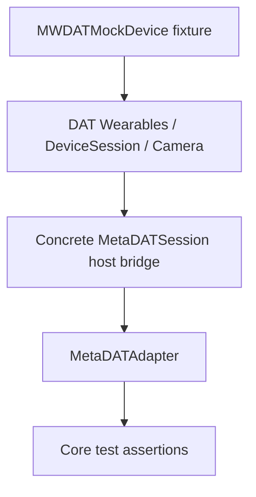
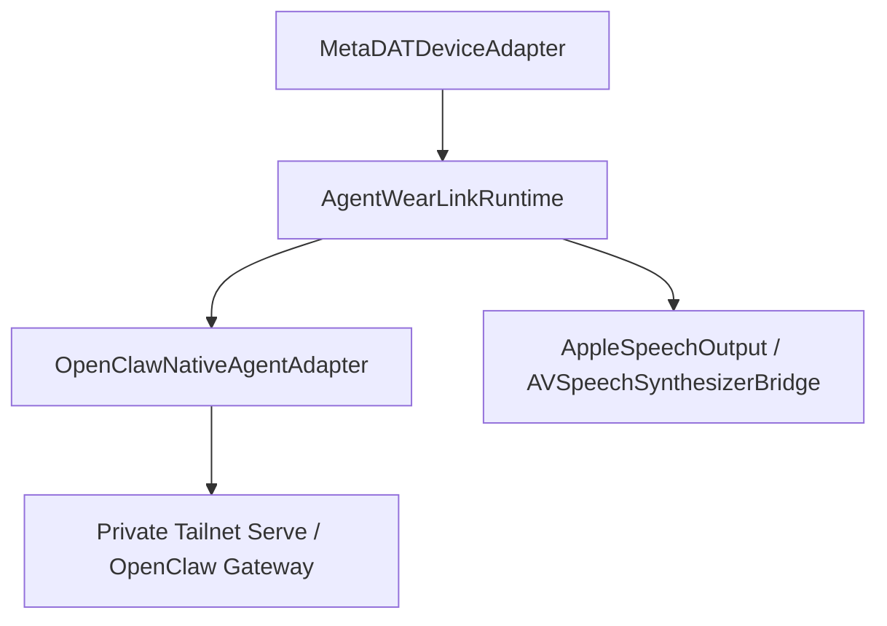

# Concrete Meta DAT bridge implementation notes

This document translates the current official Meta iOS sample patterns into the boundary required by `AgentWearLinkMetaDAT.MetaDATSession`. It is an implementation note, not a substitute for compiling against the pinned DAT package.

## Validated public API pattern

The current CameraAccess sample uses:

1. `AutoDeviceSelector(wearables: wearables)`
2. `wearables.createSession(deviceSelector: deviceSelector)`
3. subscribe to `session.statePublisher` and `session.errorPublisher`
4. call `session.start()`
5. after the session reaches `.started`, check/request camera permission
6. construct `StreamConfiguration`
7. `session.addCamera(config: config)`
8. subscribe to stream state/error/photo publishers
9. start the camera stream
10. `stream.capturePhoto(format: .jpeg)` for explicit capture
11. stop camera/session explicitly and discard terminal handles

The official sample explicitly subscribes **before** `start()` so initial transitions are not missed. AWL must preserve that ordering.

## Host ownership

The iOS reference host—not Core—should own:

- `WearablesInterface`
- `AutoDeviceSelector`
- `DeviceSession`
- listener tokens
- `MWDATCamera.Camera` / stream handles
- permission requests
- Meta registration callback handling

The bridge exposes only the existing SDK-neutral `MetaDATSession` surface to `MetaDATAdapter`.

## Lifecycle mapping

Current mapping rule:

| DAT observation | AWL bridge action |
| --- | --- |
| session starts | emit `MetaDATEvent.sessionStarted` for the active AWL interaction/session context |
| transcript | emit `.transcript` |
| voice invocation | emit `.invocation` |
| interruption | emit `.interrupted` |
| session terminal stop | emit `.sessionEnded` once |
| session/capability error | emit typed bridge `.failed` message |
| disconnect | terminate capability handles; do not replay prior interaction |

Do not invent an interaction ID from a device identifier. The host must define the interaction boundary explicitly when wiring invocation/transcript flows.

## Camera snapshot boundary

The concrete integration now contains bounded one-shot camera capture machinery: camera configuration/ignition, first-frame readiness, shutter/photo-result handling, photo normalization, capture generations, cancellation/late-result rejection, and deterministic mock fixtures.

The invariant remains:

- explicit request only;
- bounded capture lifetime;
- permission/readiness before capture;
- JPEG/PNG copied into bounded `ImageAttachment`;
- no continuous raw-frame retention by AWL;
- obsolete/late capture results are rejected;
- disconnect/background invalidation fails pending work rather than replaying it.

Physical sensor wake, shutter timing, transfer reliability, and memory behavior remain hardware validation gates.

## MockDeviceKit test seam

MockDeviceKit should feed the same normal DAT session/camera APIs. Do not create a second AWL bridge just for mocks.

Expected test path:

## Compile gate

Before merging concrete MWDAT imports into the reference host:

- pin exact Meta DAT package version
- compile the official sample with that version
- compile the bridge against the same version
- run MockDeviceKit lifecycle/camera fixture
- record API differences from this note
- update this document when symbols/signatures differ

This keeps the repository from freezing guessed or stale SDK signatures into the public adapter.

## Foreground/background ownership on the concrete adapter

Hosts may inject `MetaDATApplicationLifecycle` into
`MetaDATDeviceAdapter(applicationLifecycle:)` and forward UIKit/SwiftUI
foreground/background phase transitions. The vendor-linked adapter subscribes
before session registration/start; the latest phase is replayed to close the
preflight/subscription race. Background immediately retires the owning
DeviceSession generation, invalidates pending camera/Speech operations,
clears live capability bits and emits a terminal device failure so Core also
retires active interactions. Foreground does **not** implicitly reconnect or
replay an uncertain agent/photo request: the host must explicitly start a
fresh runtime generation. Injection is optional to preserve test/reference
compatibility, but a production UI must supply it to claim lifecycle coverage.

Mock and CI tests cannot prove physical lock-screen or iOS suspension timing;
those remain on #96/#116 and #1/#59.

## Rapid background/foreground transition guarantee

The app phase stream is bounded and preserves the first pending background
edge rather than always replacing it with the most recent foreground value.
This is deliberate: a brief lock/background transition must retire a media
generation even if the UI is foreground again before the adapter task gets
scheduled. `currentPhase` remains the authoritative latest host phase.
Foreground never replays work or automatically resurrects retired media.

## Reference iOS host composition (code-only)

`TestApp/App/AWLReferenceRuntimeHost.swift` now explicitly composes:

The iOS test host exposes a manual host/token/session-key screen, Meta AI
registration action, URL callback routing, foreground/background phase changes
and explicit connect/disconnect actions. It constructs a dedicated Keychain
pairing identity separate from read-only and mutating CLI probes, and does not
hardcode a Mac mini address, token or user session. Token input is cleared
from the SwiftUI view once a connection attempt begins. Diagnostic events
remain capacity-bounded, typed and in memory.

**Important:** This is a compile-gated reference host, not physical completion.
The project's `Info.plist` still contains test-only placeholder Meta App ID
and client token, and the host is a test bundle; replace those values in a
properly provisioned app build before a live Meta registration attempt.
The reference host has additional opt-in, foreground voice-wake composition,
including post-ack Speech handoff. This does not establish unattended locked-phone
or background startup. Tailscale, actual headset capture, voice delivery and TTS
routing must still be verified with the physical stack (#6/#5/#1).

## Explicit photo -> OpenClaw vision path

The host also exposes an **explicit** user button for one-shot photo capture
and a prompt. It uses `VisionCoordinator` over the same connected
`MetaDATDeviceAdapter` and `OpenClawNativeAgentAdapter`, with the same
bounded Apple speech sink. `supportsVisionInput` remains disabled until the
operator deliberately enables the checkbox after verifying the selected
OpenClaw model supports images. Snapshot media is not captured merely because
the app becomes active or hears an invocation. Leaving the foreground or
disconnecting cancels an in-flight photo/agent turn.

This action is code-wired but still requires a real permissioned DAT device
and image-capable OpenClaw session before declaring #58 complete.

## Independent host-owned Voice Invocation

The production `MetaDATDeviceAdapter` now exposes
`startVoiceInvocationListening()` and `stopVoiceInvocationListening()` as
**independent** entrypoints. An iOS host should first subscribe to
`device.events()`, then start voice listening after Meta registration can
complete. The listener does not call `device.connect()` and remains eligible
while camera/Speech DeviceSession is stopped. A separate registration monitor,
selected-device changes, link callbacks and bounded reopen policy own the
VoiceInvocationsStream. A supported LaunchApp invocation is acknowledged before
being emitted as a Core interaction, and callbacks from retired leases are
fenced. The host explicitly stops this channel on app shutdown; ordinary
DeviceSession disconnect does not stop it.

This is code-side composition only. No independent microphone PCM or Meta
speaker output is claimed. Unsupported invocation action subclasses currently
produce no Core event because the pinned public abstraction does not expose
an independently verified response-handle contract for all action types.
Vendor MockDeviceKit launch simulation is covered by simulator tests; physical
locked/pocketed behavior remains open under the hands-free acceptance gate #6.

## Explicit sanitized diagnostic export

The reference iOS host contains a user-triggered `Copy sanitized diagnostics`
action. It exports the in-memory `AWLDiagnosticRecorder` to schema-versioned
JSON, at most 128 events, with recorder eviction count and truncation status.
The allowlist is limited to diagnostic enum kinds, bounded numeric generation
and retry attempt, and local interaction ordinals. Raw correlation UUIDs,
hostnames, credentials, tokens, prompts, transcripts, message payloads,
error descriptions and private images **never enter the serialized model**.
The host does not log or transmit diagnostic reports automatically; tapping
the button places sanitized text on the system clipboard, which the operator
should treat as temporary and clear after capturing validation evidence.

### Reference host Voice Invocation ownership

After the reference host successfully starts the connected runtime, it calls
`MetaDATDeviceAdapter.startVoiceInvocationListening()` so that the Core device
event subscriber is already attached before any acknowledgement arrives. Normal
explicit disconnection stops the standalone voice channel first, then retires
the runtime. An unsuccessful startup rolls both owners back. The voice stream
itself is not allocated by `DeviceSession` and does not require camera or
microphone readiness, but this reference host currently starts the stream
*after* successful Gateway/media connect; fully disconnected or locked-phone
cold activation remains outside this specific connected-runtime path; see the
separate opt-in foreground composition and physical gate #6. A LaunchApp invocation
with no phrase is only an acknowledgement/event until a separate final Speech
transcript is received; it is **not** counted as an agent turn.

### MockDeviceKit Voice Invocation UI acceptance

The test host recognizes `--awl-meta-voice-ui-testing` only after the
existing explicit `--awl-meta-ui-testing` bootstrap. It simulates registered
Meta AI status only for this voice-specific regression; normal photo/pair
UI tests retain the unregistered default. `AWLMockVoiceInvocationHarness`
subscribes to the public production adapter's event stream and starts the
standalone Voice Invocation channel without opening DeviceSession. The
UI test pairs and powers MockDeviceKit glasses, observes live voice readiness,
injects `MockDeviceTestClient.sendLaunchAppAction`, and requires an
acknowledged invocation event. It is still simulator evidence, not proof of
locked-phone hardware wake behavior.
