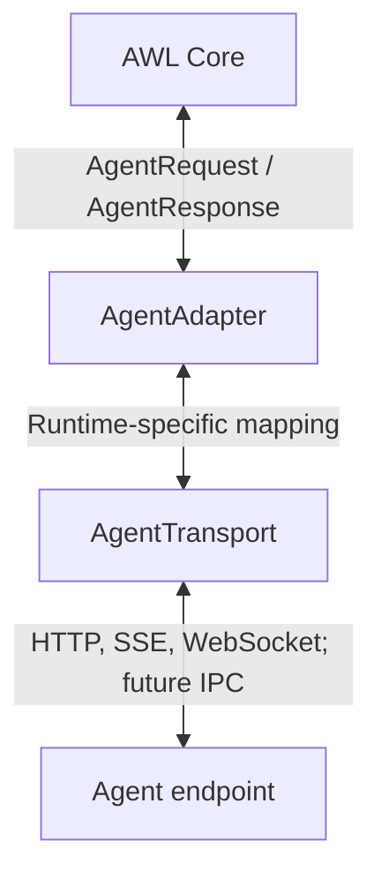

# Agent transports

AWL separates **agent semantics** from **wire transport**.

## Why this boundary exists

A buffered HTTP request can be useful for tests and simple agents, but it is not equivalent to conversational streaming. OpenClaw or another runtime may expose a different protocol depending on deployment/version.

AWL therefore does not label buffered HTTP as streaming and does not hard-code a guessed OpenClaw wire format into the core.

## Transport requirements

A streaming transport must define:

- connection ownership
- authentication
- request correlation by `InteractionID`
- incremental text response
- completion
- cancellation
- timeout
- reconnect behavior
- bounded receive buffers/backpressure
- handling of late frames after cancellation
- behavior for mutating requests (never silently replay)

## Request and buffered HTTP memory bounds

Core applies a default 256 KiB UTF-8 budget before dispatching an `AgentRequest`; callers can choose a different coordinator budget deliberately. Concrete transports must still enforce their own wire budget because encoded protocol overhead can exceed the source text size.

The baseline HTTP transport uses `maximumRequestBytes` as both a pre-encoding text ceiling and an exact post-encoding JSON body ceiling. Oversized text is therefore rejected before a large request body is constructed, while the exact encoded-size check preserves the wire contract.

The response is still semantically buffered: it is emitted only after the HTTP body completes. Its receive memory bound is enforced incrementally while downloading. `maximumResponseBytes` is therefore a hard response-body accumulation ceiling rather than a post-download validation limit. Known oversized `Content-Length` values are rejected before body consumption, and chunked/unknown-length responses are cancelled as soon as the next byte would exceed the configured ceiling.

## Transport availability

| Transport | Implemented scope |
| --- | --- |
| Buffered HTTP | Bounded request/response compatibility primitive; not incremental response streaming |
| SSE | Bounded parser and OpenAI-compatible chat streaming path where the runtime exposes it |
| WebSocket | Concrete OpenClaw Gateway transport with authenticated connection, RPC, streaming runs and reconnect |
| Local IPC | Future possibility; not advertised as implemented |

The OpenClaw native adapter uses the pinned, audited real Gateway protocol described in [OpenClaw](openclaw.md) and the [protocol contract](openclaw-protocol-contract.md). The isolated Gateway CI validates that protocol without implying a verified physical deployment.
